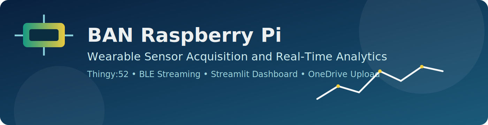
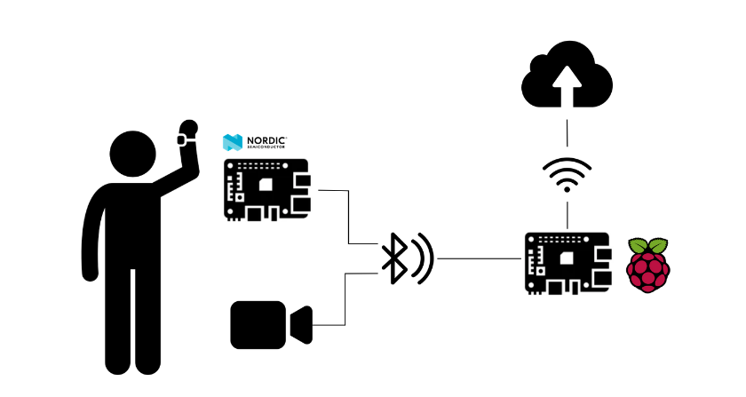
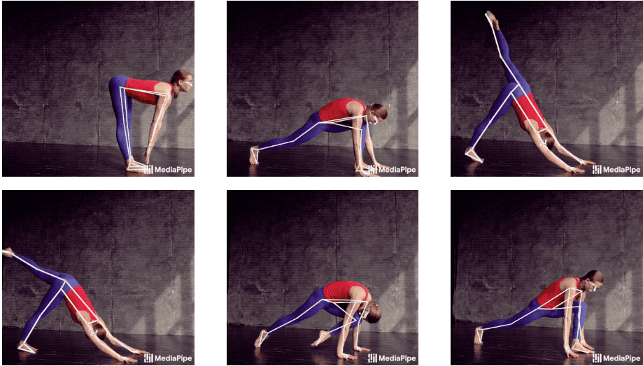
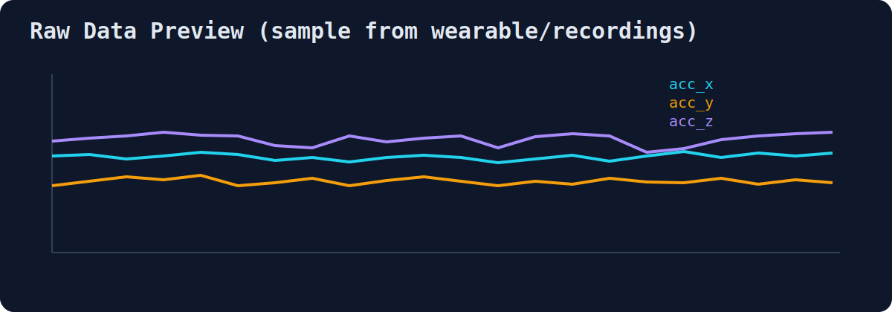

# BAN-RaspberryPi

<p align="center">
  
</p>

<p align="center">
  
  
  
  
  
</p>

A wireless Body Area Network (BAN) system for real-time multimodal patient monitoring. Collects synchronized motion data from wearable sensors via Bluetooth, captures video with live pose estimation, and uploads all data to cloud storage for centralized access.

## Project Overview

This system integrates **wearable sensors** and **computer vision** to create a complete body monitoring pipeline:

- **Bluetooth Low Energy (BLE)** streaming from Nordic Thingy:52 sensors worn on belt, wrists, and ankles
- **Real-time pose estimation** via MediaPipe Pose Landmarker (33 3D body keypoints)
- **Synchronized data collection**: sensor CSV files aligned with video timestamps
- **Cloud backup**: automatic OneDrive upload via Microsoft Graph API

Built for clinical/research settings where multimodal data (accelerometer, gyroscope, video) needs to be captured and analyzed together.

<p align="center">
  
</p>

## Tech Stack

| Component | Technology |
|-----------|-----------|
| **Language** | Python 3.10+ |
| **Web UI** | Streamlit 1.22 |
| **BLE Communication** | bluepy 1.3 (GATT notifications) |
| **Pose Estimation** | MediaPipe Pose Landmarker (TensorFlow Lite) |
| **Data Processing** | pandas, numpy |
| **Visualization** | Plotly, matplotlib |
| **Cloud Integration** | Microsoft Graph API |
| **Containerization** | Docker |

## How It Works

### Data Collection Pipeline

1. **Device Discovery**: Raspberry Pi scans for Nordic Thingy:52 wearables via BLE
2. **Sensor Streaming**: Each wearable (belt, wrists, ankles) sends binary packets over GATT notifications:
   - Accelerometer, Gyroscope, Compass (18 bytes per packet)
   - Euler angles, Quaternions, Rotation matrices, Gravity vectors
3. **Binary Parsing**: Motion/Environment delegates unpack fixed-point data and write timestamped CSV rows
4. **Threading**: Each sensor runs in a daemon thread; synchronizer Event coordinates start/stop
5. **Optional Webcam**: Parallel video capture with MediaPipe extracting 33 body keypoints per frame
6. **Post-Processing**: `processing.py` aligns camera and wearable timelines into merged datasets

### Architecture

```
┌─────────────────┐         ┌──────────────────┐
│  Thingy:52      │  BLE    │  Raspberry Pi    │
│  (5 wearables)  ├────────▶│  - bluepy        │
│                 │         │  - Delegates     │
└─────────────────┘         │  - CSV Writers   │
                            └────────┬─────────┘
┌─────────────────┐                 │
│  USB Webcam     ├─────────────────┤
│  - MediaPipe    │                 │
│  - Pose 33pts   │                 ▼
└─────────────────┘         ┌──────────────────┐
                            │  Streamlit UI    │
                            │  - Config        │
                            │  - Analytics     │
                            │  - Upload        │
                            └────────┬─────────┘
                                     │
                                     ▼
                            ┌──────────────────┐
                            │  OneDrive        │
                            │  (Graph API)     │
                            └──────────────────┘
```

**Streamlit Pages**:
- `Homepage.py`: BLE device discovery and connection management
- `1_Data_collection.py`: Session config and recording controls
- `2_Analytics.py`: Real-time sensor data visualization
- `3_Settings.py`: BLE/motion/environment parameter tuning
- `4_Upload_OneDrive.py`: File selection and cloud upload

## Based On

This project extends the [original BAN-RaspberryPi](https://github.com/CristianTuretta) by Cristian Turetta, which provides the core BLE data collection pipeline from the Thingy:52 and CSV export infrastructure.

## Contributions of this work

The original BLE sensor project was extended with cloud integration, computer vision, and improved UX:

### Cloud Integration
- **OneDrive Upload Module** (`utils/upload.py`, `utils/ms_graph.py`)
  - Microsoft Graph API integration with OAuth2 token management
  - Chunked upload sessions (handles large video files)
  - Token refresh logic to handle expiration
  - Multi-user access via shared APPLICATION_ID
  - Streamlit UI for file selection and upload progress

### Computer Vision
- **Webcam Recording** (`pages/1_Data_collection.py`)
  - Threaded video capture synchronized with sensor data
  - USB device enumeration via pyudev
  - Non-blocking architecture to keep UI responsive

- **Pose Estimation** (MediaPipe integration)
  - Real-time pose landmark detection (33 3D keypoints)
  - TensorFlow Lite backend for efficient inference
  - Background thread processing with live video overlay
  - Optional segmentation mask output
  - Keypoint export to JSON for downstream analysis

<p align="center">
  
</p>

### User Experience
- **Sampling Rate Display**: Post-session actual Hz calculation
- **Overwrite Protection**: Checks for existing files before recording, prompts for confirmation
- **Settings Page Fixes**: Resolved broken sampling frequency slider controls

## Data Output

The system generates synchronized multimodal datasets:

**Per-Sensor CSV Files** (one set per wearable position):
- `{position}_raw_data_{task}.csv`: Accelerometer, gyroscope, compass (timestamped)
- `{position}_euler_{task}.csv`: Roll, pitch, yaw angles
- `{position}_quaternion_{task}.csv`: Quaternion orientation (w, x, y, z)
- `{position}_heading_{task}.csv`: Compass bearing + cardinal direction
- `{position}_gravity_vector_{task}.csv`: Gravity vector (x, y, z)
- `{position}_rotation_matrix_{task}.csv`: 3×3 rotation matrix

**Camera Outputs**:
- `.mp4` video file
- `.json` keypoints file (33 body landmarks per frame)

**Merged Dataset** (`processing.py`):
- `*_merge.csv`: Aligned camera + wearable data (synced by timestamp)


### Example: Raw Sensor Data

<p align="center">
  
</p>

## Setup & Installation

### Prerequisites

- Python 3.10+
- Linux environment (for Bluetooth access) or Raspberry Pi
- Nordic Thingy:52 sensor(s)
- (Optional) USB webcam for pose estimation

### Local Installation

```bash
# Clone the repository
git clone https://github.com/smoltuna/BAN-RaspberryPi.git
cd BAN-RaspberryPi

# Install dependencies
pip install -r requirements.txt

# Grant Bluetooth permissions (Linux)
find /usr/local/lib -name bluepy-helper
sudo setcap cap_net_raw+e <PATH_TO_BLUEPY_HELPER>
sudo setcap cap_net_admin+eip <PATH_TO_BLUEPY_HELPER>

# Run the application
python -m streamlit run Homepage.py
```

The dashboard will open at `http://localhost:8501`

### Docker Deployment

**Main Dashboard**:
```bash
docker build -t ban-dashboard .
docker run --rm -it -p 8501:8501 ban-dashboard
```

**Wearable Sensor Process** (standalone):
```bash
cd wearable
docker build -t ban-wearable .
docker run --rm -it --privileged ban-wearable
```

### OneDrive Configuration (for uploads)

1. Register an app in [Microsoft Entra](https://portal.azure.com/) to get `APPLICATION_ID`
2. Generate authentication token:
   ```bash
   python generate_token.py <APPLICATION_ID>
   ```
3. Token is saved to `utils/token.json` (kept out of version control)

## Usage

1. **Connect Sensors**: Navigate to Homepage, scan for Thingy:52 devices, connect
2. **Configure Session**: Go to Data Collection page, set subject ID, session name, task number
3. **Start Recording**: Enable camera if needed, select sensor services, click Start
4. **Monitor**: View live sensor plots in Analytics page
5. **Upload**: Use Upload OneDrive page to send files to cloud storage

## Key Features

- Multi-sensor BLE data collection (up to 5 wearables simultaneously)
- Real-time pose estimation (33 keypoints at video frame rate)
- Synchronized camera + sensor timestamps
- Cloud backup with Microsoft Graph API
- Interactive configuration UI (sampling rate, sensor selection)
- Live analytics dashboard during recording
- Overwrite protection and session validation
- Docker containerization for deployment

## Future Improvements

- GPU acceleration for pose landmarking (CUDA/OpenCL)
- Dynamic webcam settings UI (resolution, FPS, confidence thresholds)
- Cross-platform BLE support (migrate bluepy to Bleak)
- Real-time data streaming to external analysis tools

## Security & Privacy

**Token Management**:
- `utils/token.example.json` is the template (committed)
- `utils/token.json` is runtime secret cache (gitignored)
- Regenerate with `generate_token.py` if expired
- Rotate tokens immediately if accidentally exposed

**Data Privacy**:
- Recordings may contain sensitive behavioral/health data
- Apply proper access controls to OneDrive shared folders
- Consider data anonymization before sharing datasets

## License

MIT License - see [LICENSE](LICENSE) for details.

## Contributors

Simone Xiao
Edoardo Bazzotti
Flavio Zhou

---

**Questions or Issues?** Open an issue on [GitHub](https://github.com/smoltuna/BAN-RaspberryPi/issues).
